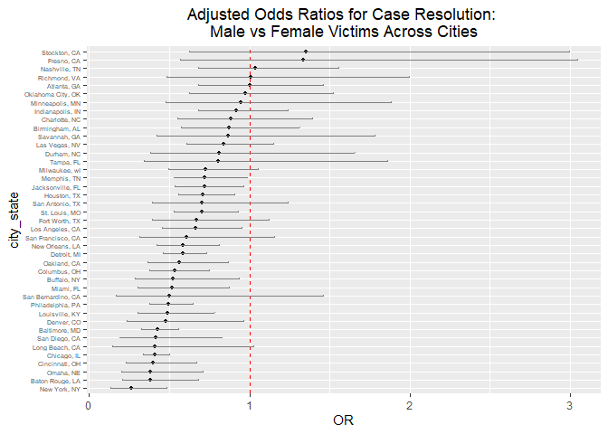
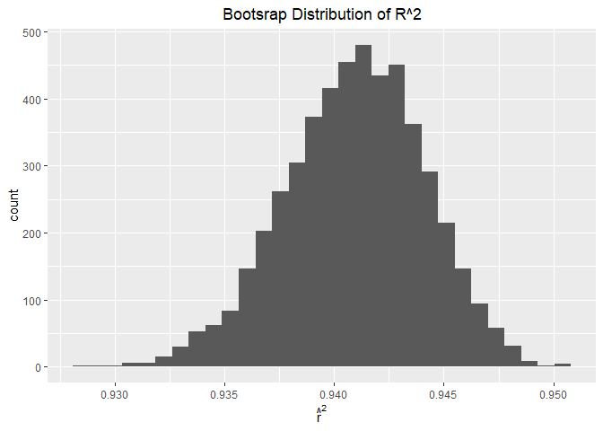
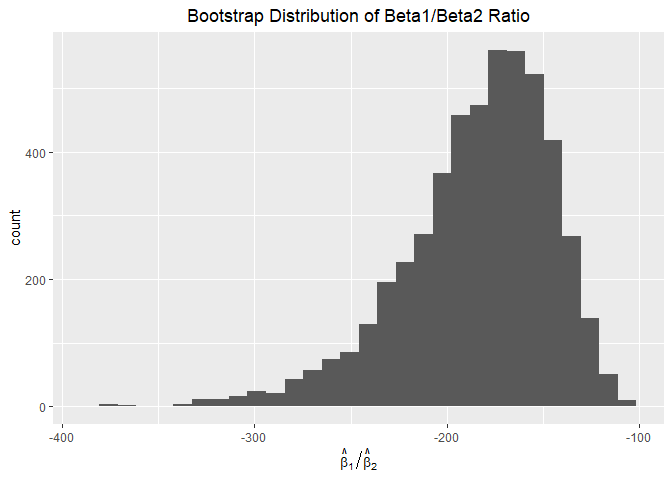

p8105_hw6_yl6109
================
Yurou Liu
2025-11-30

## Problem 1

``` r
# Tidying data
hc_data = read_csv("./data/homicide-data.csv") %>% 
  janitor::clean_names() %>% 
  mutate(city_state = paste(city, state, sep = ", "))
```

    ## Rows: 52179 Columns: 12
    ## ── Column specification ────────────────────────────────────────────────────────
    ## Delimiter: ","
    ## chr (9): uid, victim_last, victim_first, victim_race, victim_age, victim_sex...
    ## dbl (3): reported_date, lat, lon
    ## 
    ## ℹ Use `spec()` to retrieve the full column specification for this data.
    ## ℹ Specify the column types or set `show_col_types = FALSE` to quiet this message.

``` r
hc_df = hc_data %>% 
  filter(!city %in% c("Dallas", "Phoenix", "Kansas City", "Tulsa")) %>% 
  filter(victim_race %in% c("White", "Black")) %>% 
  mutate(resolved = ifelse(disposition == "Closed by arrest", 1, 0)) %>% 
  mutate(victim_age = ifelse(victim_age == "Unknown", NA, victim_age), 
         victim_age = as.numeric(victim_age))

# For Baltimore MD,
btm_df = hc_df %>% 
  filter(city == "Baltimore") %>% 
  filter(!is.na(victim_age))

btm_model = glm(resolved ~ victim_age + victim_sex + victim_race, data = btm_df, family = binomial())

btm_results = btm_model %>% 
  broom::tidy(conf.int = TRUE, exponentiate = TRUE)

btm_hc_sex = btm_results %>% 
  filter(term == "victim_sexMale") %>% 
  select(estimate, conf.low, conf.high)

# For each city, 
city_data = hc_df %>% 
  filter(!is.na(victim_age)) %>% 
  group_by(city_state) %>% 
  filter(length(unique(victim_sex)) == 2, 
         length(unique(resolved)) == 2) %>%
  ungroup()

nested_city_data = city_data %>% 
  group_by(city_state) %>% 
  nest() %>% 
  ungroup() 

city_logistic = function(df) {
    model = glm(resolved ~ victim_age + victim_sex + victim_race, data = df, family = binomial())
    
    broom::tidy(model, conf.int = TRUE, exponentiate = TRUE) %>%
      filter(term == "victim_sexMale") %>%
      select(estimate, conf.low, conf.high)
}

city_results = nested_city_data %>% 
  mutate(model_output = map(data, city_logistic)) %>% 
  unnest(model_output) %>% 
  select(city_state, 
         OR = estimate, 
         OR_low = conf.low, 
         OR_high = conf.high)

# Visualization
city_results_ordered = city_results %>% 
  mutate(city_state = fct_reorder(city_state, OR))

city_results_ordered %>% 
  ggplot(aes(x = city_state, y = OR, ymin = OR_low, ymax = OR_high)) + 
  geom_point(size = 1) + 
  labs(title = "Adjusted Odds Ratios for Case Resolution: 
Male vs Female Victims Across Cities") + 
  geom_hline(yintercept = 1, linetype = "dashed", color = "red") +
  geom_errorbar(width = 0.2, color = "gray50") + 
  coord_flip() + 
  theme(axis.text.y = element_text(size = 5), 
        plot.title = element_text(hjust = 0.5))
```

<!-- -->
Comment: This plot shows that among 41 cities, the adjusted odds ratio
for solving homicides comparing male victims to female victims of
Richnomd VA, Nashville TN, Fresno CA and Stockton CA reached 1. The CIs
for adjusted OR of 21 cities do not include 1, indicating that there is
no statistically significant gender disparity in case resolution rates
in these cities.

## Problem 2

``` r
# Bootstraps
library(p8105.datasets)
data("weather_df")

set.seed(307)

bootstraps = tibble(strap_number = 1:5000) %>% 
  mutate(strap_sample = map(strap_number, ~ {
    sample_n(weather_df, size = nrow(weather_df), replace = TRUE)
  }), 
  model = map(strap_sample, ~ lm(tmax ~ tmin + prcp, data = .x)), 
  r_squared = map_dbl(model, ~ glance(.x)$r.squared), 
  coefs = map(model, tidy))

boot_results = bootstraps %>%
  unnest(coefs) %>% 
  select(strap_number, term, estimate, r_squared) %>% 
  pivot_wider(names_from = term, 
              values_from = estimate) %>% 
  mutate(ratio = tmin / prcp) %>% 
  rename(beta_1 = tmin,
         beta_2 = prcp) %>% 
  filter(is.finite(ratio)) %>% 
  print()
```

    ## # A tibble: 5,000 × 6
    ##    strap_number r_squared `(Intercept)` beta_1   beta_2 ratio
    ##           <int>     <dbl>         <dbl>  <dbl>    <dbl> <dbl>
    ##  1            1     0.950          7.59   1.03 -0.00651 -158.
    ##  2            2     0.948          7.47   1.03 -0.00413 -249.
    ##  3            3     0.936          7.89   1.01 -0.00596 -170.
    ##  4            4     0.942          8.05   1.00 -0.00781 -129.
    ##  5            5     0.934          7.78   1.01 -0.00463 -218.
    ##  6            6     0.935          7.88   1.01 -0.00551 -184.
    ##  7            7     0.939          7.88   1.01 -0.00632 -160.
    ##  8            8     0.937          7.80   1.02 -0.00511 -200.
    ##  9            9     0.941          7.84   1.01 -0.00604 -168.
    ## 10           10     0.941          7.84   1.01 -0.00546 -186.
    ## # ℹ 4,990 more rows

``` r
# Plot: distribution of r^2
plot_r2 = boot_results %>% 
  ggplot(aes(x = r_squared)) + 
  geom_histogram() + 
  labs(title = "Bootsrap Distribution of R^2", 
       x = expression(hat(r)^2)) + 
  theme(plot.title = element_text(hjust = 0.5))

# Plot: distribution of ratio
plot_ratio = boot_results %>% 
  ggplot(aes(x = ratio)) + 
  geom_histogram() + 
  labs(title = "Bootstrap Distribution of Beta1/Beta2 Ratio", 
       x = expression(hat(beta)[1] / hat(beta)[2])) + 
  theme(plot.title = element_text(hjust = 0.5))

print(plot_r2)
```

    ## `stat_bin()` using `bins = 30`. Pick better value with `binwidth`.

<!-- -->

``` r
print(plot_ratio)
```

    ## `stat_bin()` using `bins = 30`. Pick better value with `binwidth`.

<!-- -->

``` r
# Confidence interval for r^2
ci_r2 = boot_results %>% 
  summarize(lower = quantile(r_squared, 0.025),
            upper = quantile(r_squared, 0.975)) %>% 
  print()
```

    ## # A tibble: 1 × 2
    ##   lower upper
    ##   <dbl> <dbl>
    ## 1 0.934 0.947

``` r
# Confidence interval for ratio
ci_ratio = boot_results %>% 
  summarize(lower = quantile(ratio, 0.025),
            upper = quantile(ratio, 0.975)) %>% 
  print()
```

    ## # A tibble: 1 × 2
    ##   lower upper
    ##   <dbl> <dbl>
    ## 1 -277. -125.

Comment: The distribution of r_squared is approximately normal
distribution, the center falls around 0.04. The distribution of the
ratio of beta1 to beta2 exhibits strong right skewness, with the
majority clustering between -150 and -50.

## Problem 3

``` r
# Data tidying
bw_data = read_csv("./data/birthweight.csv") %>% 
  janitor::clean_names()
```

    ## Rows: 4342 Columns: 20
    ## ── Column specification ────────────────────────────────────────────────────────
    ## Delimiter: ","
    ## dbl (20): babysex, bhead, blength, bwt, delwt, fincome, frace, gaweeks, malf...
    ## 
    ## ℹ Use `spec()` to retrieve the full column specification for this data.
    ## ℹ Specify the column types or set `show_col_types = FALSE` to quiet this message.

``` r
clean_data = bw_data %>% 
  rename(
    baby_sex = babysex,
    head_circumference = bhead,
    birth_length = blength,
    birth_weight = bwt,
    delivery_weight = delwt,
    family_income = fincome,
    father_race = frace,
    gestational_age = gaweeks,
    malformations = malform,
    menarche_age = menarche,
    mother_height = mheight,
    mother_age = momage,
    mother_race = mrace,
    parity = parity,
    prior_low_birth_weight = pnumlbw,
    prior_small_gestational_age = pnumsga,
    pre_pregnancy_bmi = ppbmi,
    pre_pregnancy_weight = ppwt,
    cigarettes_per_day = smoken,
    weight_gain = wtgain
  ) %>% 
  mutate(
    baby_sex = factor(baby_sex, levels = c(1, 2)), 
    father_race = factor(father_race, levels = c(1, 2, 3, 4, 8, 9)), 
    malformations = factor(malformations, levels = c(0, 1)), 
    mother_race = factor(mother_race, levels = c(1, 2, 3, 4, 8))
  ) %>% 
  drop_na()

# Propose regression model
model_bw = lm(birth_weight ~ 
                head_circumference + 
                birth_length + 
                baby_sex + 
                malformations + 
                mother_height + 
                mother_age + 
                pre_pregnancy_bmi + 
                gestational_age + 
                parity + 
                cigarettes_per_day + 
                weight_gain + 
                family_income + 
                mother_race, 
              data = clean_data)
summary(model_bw)
```

    ## 
    ## Call:
    ## lm(formula = birth_weight ~ head_circumference + birth_length + 
    ##     baby_sex + malformations + mother_height + mother_age + pre_pregnancy_bmi + 
    ##     gestational_age + parity + cigarettes_per_day + weight_gain + 
    ##     family_income + mother_race, data = clean_data)
    ## 
    ## Residuals:
    ##      Min       1Q   Median       3Q      Max 
    ## -1099.79  -184.63    -3.84   174.60  2353.84 
    ## 
    ## Coefficients:
    ##                      Estimate Std. Error t value Pr(>|t|)    
    ## (Intercept)        -6461.0551   136.8646 -47.208  < 2e-16 ***
    ## head_circumference   130.7046     3.4482  37.905  < 2e-16 ***
    ## birth_length          74.9630     2.0200  37.110  < 2e-16 ***
    ## baby_sex2             28.7250     8.4616   3.395 0.000693 ***
    ## malformations1        11.0021    70.5942   0.156 0.876159    
    ## mother_height         12.1883     1.6496   7.389 1.77e-13 ***
    ## mother_age             0.4655     1.1986   0.388 0.697742    
    ## pre_pregnancy_bmi      8.1936     1.3464   6.085 1.26e-09 ***
    ## gestational_age       11.5684     1.4648   7.898 3.57e-15 ***
    ## parity                95.4449    40.4610   2.359 0.018372 *  
    ## cigarettes_per_day    -4.8409     0.5858  -8.263  < 2e-16 ***
    ## weight_gain            4.1206     0.3942  10.454  < 2e-16 ***
    ## family_income          0.3016     0.1788   1.686 0.091803 .  
    ## mother_race2        -137.8255    10.2022 -13.509  < 2e-16 ***
    ## mother_race3         -75.7984    42.7014  -1.775 0.075955 .  
    ## mother_race4         -99.7936    19.3601  -5.155 2.66e-07 ***
    ## ---
    ## Signif. codes:  0 '***' 0.001 '**' 0.01 '*' 0.05 '.' 0.1 ' ' 1
    ## 
    ## Residual standard error: 272.4 on 4326 degrees of freedom
    ## Multiple R-squared:  0.7181, Adjusted R-squared:  0.7171 
    ## F-statistic: 734.7 on 15 and 4326 DF,  p-value: < 2.2e-16

``` r
model_step = step(model_bw, direction = "both") 
```

    ## Start:  AIC=48709.12
    ## birth_weight ~ head_circumference + birth_length + baby_sex + 
    ##     malformations + mother_height + mother_age + pre_pregnancy_bmi + 
    ##     gestational_age + parity + cigarettes_per_day + weight_gain + 
    ##     family_income + mother_race
    ## 
    ##                      Df Sum of Sq       RSS   AIC
    ## - malformations       1      1802 320969526 48707
    ## - mother_age          1     11192 320978916 48707
    ## <none>                            320967724 48709
    ## - family_income       1    210991 321178715 48710
    ## - parity              1    412864 321380587 48713
    ## - baby_sex            1    855058 321822782 48719
    ## - pre_pregnancy_bmi   1   2747648 323715372 48744
    ## - mother_height       1   4050390 325018114 48762
    ## - gestational_age     1   4627918 325595641 48769
    ## - cigarettes_per_day  1   5066191 326033914 48775
    ## - weight_gain         1   8109011 329076734 48815
    ## - mother_race         3  13707758 334675482 48885
    ## - birth_length        1 102176162 423143885 49907
    ## - head_circumference  1 106601672 427569396 49952
    ## 
    ## Step:  AIC=48707.15
    ## birth_weight ~ head_circumference + birth_length + baby_sex + 
    ##     mother_height + mother_age + pre_pregnancy_bmi + gestational_age + 
    ##     parity + cigarettes_per_day + weight_gain + family_income + 
    ##     mother_race
    ## 
    ##                      Df Sum of Sq       RSS   AIC
    ## - mother_age          1     11368 320980894 48705
    ## <none>                            320969526 48707
    ## - family_income       1    210276 321179802 48708
    ## + malformations       1      1802 320967724 48709
    ## - parity              1    412636 321382161 48711
    ## - baby_sex            1    854087 321823613 48717
    ## - pre_pregnancy_bmi   1   2747971 323717497 48742
    ## - mother_height       1   4048862 325018388 48760
    ## - gestational_age     1   4626519 325596045 48767
    ## - cigarettes_per_day  1   5064518 326034044 48773
    ## - weight_gain         1   8126379 329095905 48814
    ## - mother_race         3  13722119 334691645 48883
    ## - birth_length        1 102187758 423157284 49905
    ## - head_circumference  1 106613825 427583351 49950
    ## 
    ## Step:  AIC=48705.3
    ## birth_weight ~ head_circumference + birth_length + baby_sex + 
    ##     mother_height + pre_pregnancy_bmi + gestational_age + parity + 
    ##     cigarettes_per_day + weight_gain + family_income + mother_race
    ## 
    ##                      Df Sum of Sq       RSS   AIC
    ## <none>                            320980894 48705
    ## - family_income       1    242157 321223051 48707
    ## + mother_age          1     11368 320969526 48707
    ## + malformations       1      1978 320978916 48707
    ## - parity              1    425515 321406409 48709
    ## - baby_sex            1    848776 321829670 48715
    ## - pre_pregnancy_bmi   1   2830037 323810931 48741
    ## - mother_height       1   4115912 325096806 48759
    ## - gestational_age     1   4667205 325648099 48766
    ## - cigarettes_per_day  1   5066180 326047074 48771
    ## - weight_gain         1   8141956 329122850 48812
    ## - mother_race         3  14681999 335662893 48894
    ## - birth_length        1 102181550 423162444 49903
    ## - head_circumference  1 106657741 427638635 49949

``` r
summary(model_step)
```

    ## 
    ## Call:
    ## lm(formula = birth_weight ~ head_circumference + birth_length + 
    ##     baby_sex + mother_height + pre_pregnancy_bmi + gestational_age + 
    ##     parity + cigarettes_per_day + weight_gain + family_income + 
    ##     mother_race, data = clean_data)
    ## 
    ## Residuals:
    ##      Min       1Q   Median       3Q      Max 
    ## -1100.07  -185.18    -3.59   174.07  2353.50 
    ## 
    ## Coefficients:
    ##                      Estimate Std. Error t value Pr(>|t|)    
    ## (Intercept)        -6457.0283   136.4961 -47.306  < 2e-16 ***
    ## head_circumference   130.7253     3.4471  37.923  < 2e-16 ***
    ## birth_length          74.9442     2.0191  37.118  < 2e-16 ***
    ## baby_sex2             28.6023     8.4547   3.383 0.000723 ***
    ## mother_height         12.2403     1.6431   7.450 1.12e-13 ***
    ## pre_pregnancy_bmi      8.2566     1.3366   6.177 7.12e-10 ***
    ## gestational_age       11.5983     1.4620   7.933 2.70e-15 ***
    ## parity                96.6171    40.3359   2.395 0.016649 *  
    ## cigarettes_per_day    -4.8395     0.5855  -8.265  < 2e-16 ***
    ## weight_gain            4.1081     0.3921  10.478  < 2e-16 ***
    ## family_income          0.3158     0.1747   1.807 0.070835 .  
    ## mother_race2        -138.8055     9.9071 -14.011  < 2e-16 ***
    ## mother_race3         -73.7032    42.3305  -1.741 0.081731 .  
    ## mother_race4        -100.2662    19.3235  -5.189 2.21e-07 ***
    ## ---
    ## Signif. codes:  0 '***' 0.001 '**' 0.01 '*' 0.05 '.' 0.1 ' ' 1
    ## 
    ## Residual standard error: 272.3 on 4328 degrees of freedom
    ## Multiple R-squared:  0.7181, Adjusted R-squared:  0.7173 
    ## F-statistic: 848.1 on 13 and 4328 DF,  p-value: < 2.2e-16

``` r
AIC_full = AIC(model_bw)
AIC_step = AIC(model_step)
difference = AIC_full - AIC_step

# AIC of model_step is 3.8 lower than model_bw. Thus model birth_weight ~ head_circumference + birth_length + baby_sex + mother_height + pre_pregnancy_bmi + gestational_age + parity + cigarettes_per_day + weight_gain + family_income + mother_race is better.

# Plot: residuals vs fitted values
model_final = model_step

data_with_residual = clean_data %>% 
  add_predictions(model = model_final) %>% 
  add_residuals(model = model_final)

data_with_residual %>% 
  ggplot(aes(x = pred, y = resid)) + 
  geom_point(alpha = 0.3, color = "gray20") + 
  labs(title = "Residuals vs Fitted Values", 
       x = "Fitted Values (g)", 
       y = "Residuals (g)") + 
  theme(plot.title = element_text(hjust = 0.5))
```

<!-- -->

``` r
# Compare model_final with the other two models
set.seed(307)

cv_df = crossv_mc(clean_data, 100) %>% 
  mutate(
    train = map(train, as_tibble),
    test = map(test, as_tibble)
  ) %>% 
  mutate(
    model_simple = map(train, ~lm(birth_weight ~ birth_length + gestational_age, data = .x)), 
    model_interaction = map(train, ~lm(birth_weight ~ head_circumference * birth_length * baby_sex, data = .x)), 
    model_final = map(train, ~lm(formula(model_final), data = .x))
  ) %>% 
  mutate(
    rmse_simple = map2_dbl(model_simple, test, ~rmse(model = .x, data = .y)),
    rmse_interaction = map2_dbl(model_interaction, test, ~rmse(model = .x, data = .y)),
    rmse_final = map2_dbl(model_final, test, ~rmse(model = .x, data = .y))
  )
```

    ## Warning: There were 3 warnings in `mutate()`.
    ## The first warning was:
    ## ℹ In argument: `rmse_final = map2_dbl(model_final, test, ~rmse(model = .x, data
    ##   = .y))`.
    ## Caused by warning in `predict.lm()`:
    ## ! prediction from rank-deficient fit; attr(*, "non-estim") has doubtful cases
    ## ℹ Run `dplyr::last_dplyr_warnings()` to see the 2 remaining warnings.

``` r
cv_result = cv_df %>% 
  select(starts_with("rmse")) %>% 
  summarize(
    avg_rmse_simple = mean(rmse_simple),
    avg_rmse_interaction = mean(rmse_interaction),
    avg_rmse_final = mean(rmse_final),
    sd_rmse_simple = sd(rmse_simple),
    sd_rmse_interaction = sd(rmse_interaction),
    sd_rmse_final = sd(rmse_final)
  )
```

Comment: based on cross-validation results, the final model achieves
lower prediction error (RMSE = 289.2g) compared to the simple model
(332.4g) and demonstrates greater stability than the interaction model
with smaller standard deviation, indicating that incorporating multiple
relevant factors provides more accurate predictions of infant birth
weight.
